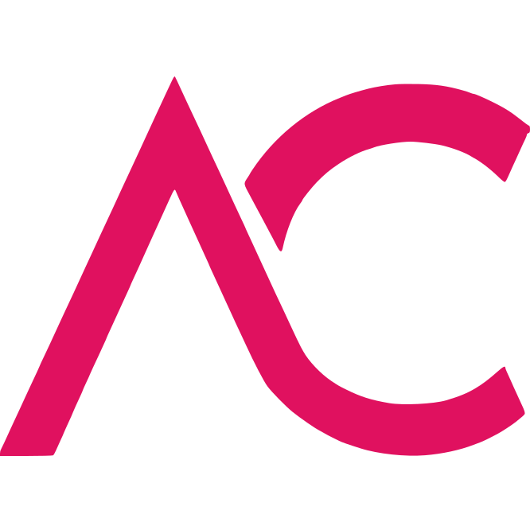
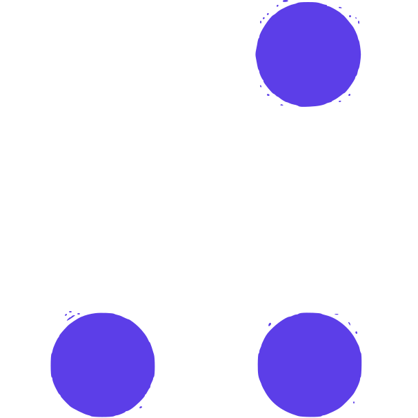
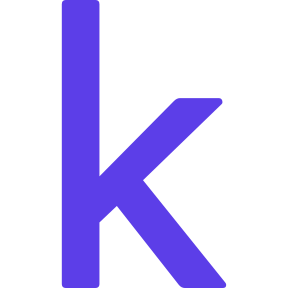

• Junior Quant [@XTX Markets](https://www.xtxmarkets.com/)            

**Education**  
• Master's Degree - Computer Science [@ETH Zurich](https://ethz.ch/en.html/)
 
• Bachelor's Degree - Mathematics [@University of Warwick](https://warwick.ac.uk/)

**Experience**  
• Algorithm Engineer Intern [@Huawei](https://www.huawei.com/en/)
 
• Undergraduate Researcher [@EPFL](https://www.polytechnique.edu/en/)
 
• Undergraduate Researcher [@TU-Delft](https://www.tudelft.nl/en/)
 
• Game Mathematician Intern [@Entain](https://entaingroup.com/)

**Volunteering**  
• Teaching Assistant [@University of Warwick](https://warwick.ac.uk/)
 
• Game Data Miner [@Unite-DB](https://unite-db.com/) and [@OP.gg](https://www.op.gg/)

#### Languages       

#### Languages       

 <b>¤ Competitive Programming ¤</b>

  
  
  
  <a href="https://projecteuler.net/profile/<>.png">  </a>
  <a href="https://www.topcoder.com/members/<>">  </a>
  
  <a href="https://auth.geeksforgeeks.org/user/<>">  </a>
  
  
  <a href="https://www.spoj.com/users/<>">  </a>

 <b>¤ Organizations ¤</b>

  
  
  
  
  

#### Socials 

 <b> &#128474;¤ Socials ¤</b>
  
  
  
  
  
  
  

  

