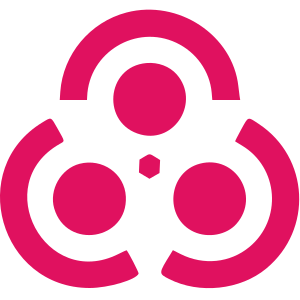

 <b>¤ Languages ¤</b>

  
  
  
  
  
  
  

 <b>¤ Competitive Programming ¤</b>

  <a href="https://atcoder.jp/users/<>">  </a>
  <a href="https://leetcode.com/<>">  </a>
  <a href="https://codeforces.com/profile/<>">  </a>
  <a href="https://projecteuler.net/profile/<>.png">  </a>
  <a href="https://www.topcoder.com/members/<>">  </a>
  <a href="https://open.kattis.com/users/<>">  </a>
  <a href="https://auth.geeksforgeeks.org/user/<>">  </a>
  <a href="https://www.codechef.com/users/<>">  </a>
  <a href="https://binarysearch.com/@/<>">  </a>
  <a href="https://www.spoj.com/users/<>">  </a>

  

